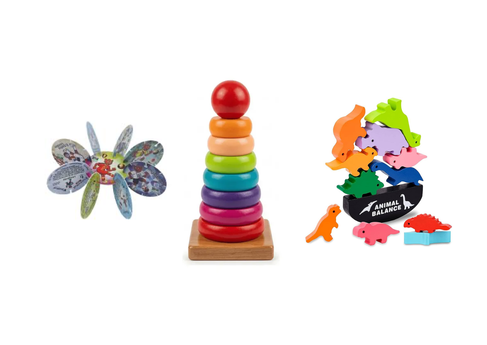
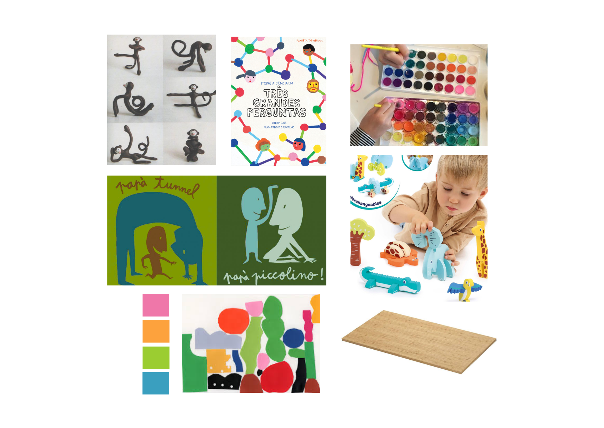
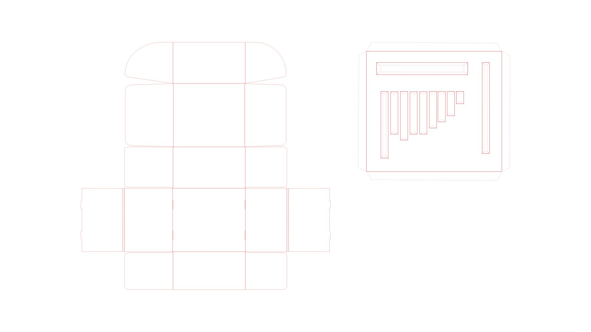
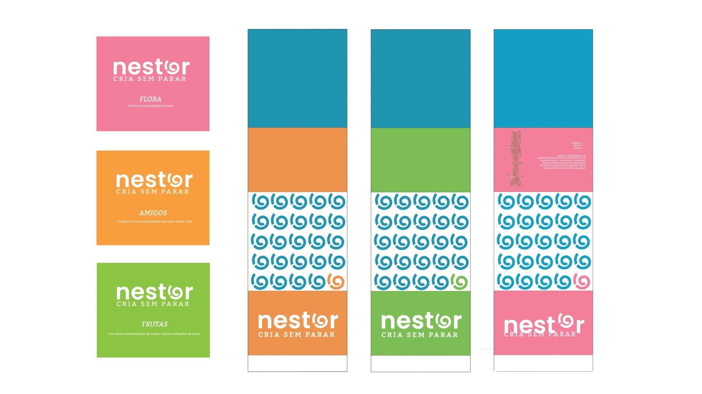
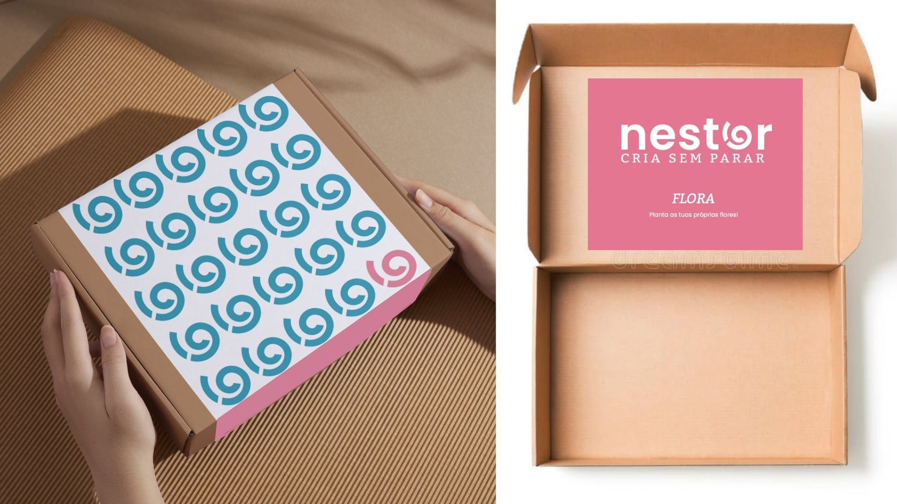

# Contexto de Design

Página explicativa do contexto, em concordância com a apresentação produzida em grupo. Componente de **grupo**.

## 1. Resumo / Abstract

### Resumo (PT)

O NESTOR surge como uma proposta de design sustentável que procura transformar desperdício industrial em objetos lúdicos, educativos e duradouros. A marca assenta numa abordagem autossustentável baseada na reutilização de material excedente da indústria do mobiliário, utilizando o processo de nesting para inserir automaticamente pequenos brinquedos nas áreas não utilizadas dos planos de corte CNC. Desta forma, o projeto procura reduzir o desperdício de matéria-prima e dar uma nova função ao excedente de madeira, transformando resíduos em oportunidades criativas.

Produzidos em bambu através de corte CNC, os brinquedos NESTOR exploram a relação entre fabricação digital, modularidade e aprendizagem infantil. O uso do bambu reforça a dimensão ecológica do projeto, valorizando um material resistente, natural e renovável. Simultaneamente, a tecnologia CNC permite criar sistemas de encaixe precisos e adaptáveis, capazes de gerar diferentes configurações a partir de um número reduzido de peças. A lógica modular torna-se assim central no projeto, permitindo que cada brinquedo seja desmontado, reorganizado e reinterpretado de múltiplas formas.

Dirigido a crianças entre os 3 e os 6 anos, o projeto foi pensado para estimular a criatividade, a exploração e a construção livre numa fase essencial do desenvolvimento cognitivo e motor. As formas simples e orgânicas das peças evocam elementos familiares do universo infantil, como flores, folhas, frutos e animais, aproximando a criança da natureza através da brincadeira. Estas referências originam três universos conceptuais principais — natureza, animais e comida — que funcionam como base para diferentes linhas de produto e experiências de interação.

A coleção inspirada na natureza explora formas orgânicas e sistemas de crescimento semelhantes a flores, folhas ou sementes, incentivando a criança a construir composições abertas e mutáveis. A linha associada aos animais procura estimular a imaginação através da criação de criaturas híbridas e personagens construídas a partir da combinação das peças. Já a vertente ligada à comida utiliza formas arredondadas e cores mais vibrantes para criar objetos que remetem para frutos, doces ou ingredientes, promovendo associações lúdicas e sensoriais.

O sistema de encaixe modular constitui o núcleo conceptual do projeto. Inspirado em brinquedos e sistemas prexistentes, criamos peças que podem ser recombinadas livremente, incentivando a experimentação, a resolução de problemas e o pensamento criativo.

O acabamento neutro em bambu permite ainda que as peças possam ser posteriormente pintadas, desenhadas ou decoradas, transformando cada conjunto numa criação única e prolongando o tempo de interação com o brinquedo.

Formalmente, o projeto foi influenciado pelo trabalho de designers e ilustradores como Enzo Mari, Nora Puzzles e Bernardo Carvalho. A simplicidade gráfica, as formas orgânicas e a dimensão pedagógica presentes nestas referências contribuíram para o desenvolvimento de uma linguagem visual contemporânea, intuitiva e acessível ao universo infantil.

Mais do que um brinquedo, o NESTOR propõe uma reflexão sobre a relação entre design, sustentabilidade e educação. Ao reutilizar desperdício industrial para criar objetos de aprendizagem e imaginação, o projeto procura sensibilizar para uma utilização mais consciente dos materiais e para a importância da criatividade como ferramenta de transformação.

### Abstract (EN)
NESTOR is a sustainable design project that aims to transform industrial waste into playful, educational, and long-lasting objects. The brand is based on a self-sustaining approach that reuses surplus material from the furniture industry, employing the nesting process to automatically insert small toys into the unused areas of CNC cutting layouts. In this way, the project seeks to reduce raw material waste and give a new purpose to excess wood, turning discarded material into creative opportunities.

Manufactured in bamboo through CNC cutting, NESTOR toys explore the relationship between digital fabrication, modularity, and childhood learning. The use of bamboo reinforces the project’s ecological dimension, valuing a material that is durable, natural, and renewable. At the same time, CNC technology enables the creation of precise and adaptable interlocking systems capable of generating multiple configurations from a limited number of pieces. Modularity therefore becomes a central aspect of the project, allowing each toy to be assembled, disassembled, reorganized, and reinterpreted in different ways.

Designed for children between the ages of three and six, the project aims to encourage creativity, exploration, and open-ended construction during a crucial stage of cognitive and motor development. The simple, organic forms evoke familiar elements from a child’s world, such as flowers, leaves, fruits, and animals, fostering a connection with nature through play. These references give rise to three main conceptual collections — Nature, Animals, and Food — which serve as the foundation for different product lines and playful experiences.

The Nature collection explores organic forms and growth systems inspired by flowers, leaves, and seeds, encouraging children to create open and constantly evolving compositions. The Animals collection stimulates imagination through the creation of hybrid creatures and characters assembled from interchangeable components. The Food collection adopts rounded shapes and vibrant visual references inspired by fruits, sweets, and ingredients, promoting playful and sensory associations.

The modular interlocking system constitutes the conceptual core of the project. Inspired by existing construction toys and educational systems, the pieces can be freely recombined, encouraging experimentation, problem-solving, and creative thinking. The neutral bamboo finish also allows children to paint, draw, and customize the pieces, transforming each set into a unique creation while extending the toy’s lifespan and enriching the interaction experience.

Formally, the project was influenced by the work of designers and illustrators such as Enzo Mari, Nora puzzles, and Bernardo Carvalho. The graphic simplicity, organic shapes, and educational dimension present in these references contributed to the development of a contemporary visual language that is intuitive, engaging, and accessible to children.

More than a toy, NESTOR proposes a reflection on the relationship between design, sustainability, and education. By reusing industrial waste to create objects that inspire learning and imagination, the project seeks to promote a more conscious use of materials and highlight creativity as a powerful tool for transformation.

## 2. Referências Coletivas

### 2.1. Recolha de Objetos a Redesenhar/Remisturar

Catálogo de objetos de partida que o grupo identificou para o redesenho. Para cada objeto: imagem, origem, motivo da escolha.

- **Tazos** — Os tazos surgiram na década de 1990 como pequenos discos colecionáveis distribuídos principalmente em embalagens de snacks e cereais. Inspirados no jogo tradicional havaiano milk caps, tornaram-se um fenómeno global entre crianças e marcaram uma geração. Para além do jogo em si, os tazos destacavam-se pela possibilidade de troca, combinação e personalização, incentivando a interação social e a criatividade infantil.

A simplicidade formal dos tazos — baseada em formas circulares planas e sistemas intuitivos de utilização — serviu como principal referência para o desenvolvimento deste brinquedo. A ideia foi reinterpretar essa lógica modular através de peças em bambu produzidas por corte CNC, transformando um objeto associado à cultura popular infantil num sistema construtivo contemporâneo e sustentável.

A escolha desta referência relaciona-se também com a intenção de criar um brinquedo acessível, intuitivo e aberto a múltiplas interpretações.
- **Brinquedos empilháveis tradicionais** — Inspirado nos brinquedos Montessori, desenvolvidos a partir do método educativo criado por Maria Montessori, em Itália, no início do século XX.  
    A escolha deste objeto surgiu pelo uso de madeira e materiais naturais, pela interação infantil e pela simplicidade das formas e cores. O sistema de empilhar e encaixar permitiu explorar a criatividade e a aprendizagem através da brincadeira. A possibilidade de criar diferentes combinações de formas e tamanhos influenciou o desenvolvimento do sistema modular do projeto NESTOR, incentivando a personalização e a experimentação por parte da criança.- 

    
    **Stacking balancing toys** — ..O Stacking Balancing Toy é um brinquedo de equilíbrio composto por três diferentes formas de macacos, cada uma representada numa posição diferente. O objetivo consiste em encaixar e empilhar as peças umas sobre as outras, criando estruturas equilibradas sem que estas caiam. A simplicidade das formas permite diferentes combinações, tornando cada tentativa diferente.

Este brinquedo é conhecido como stacking balancing toy ou brinquedo de equilíbrio em madeira. A sua origem está associada aos brinquedos artesanais europeus, desenvolvidos para estimular a aprendizagem através da manipulação e da experimentação. Posteriormente, este tipo de brinquedo passou a ser amplamente utilizado em abordagens educativas como os métodos Montessori e Waldorf, devido à sua capacidade de promover o desenvolvimento da coordenação motora, da concentração, da criatividade e da perceção espacial nas crianças.
O principal objetivo destes brinquedos consiste em empilhar e equilibrar diferentes peças sem que a estrutura perca estabilidade, transformando a brincadeira num desafio educativo.
A escolha deste tipo de brinquedo surgiu pelo seu potencial educativo e pela possibilidade de explorar conceitos de equilíbrio e construção através de formas simples. A opção pela figura do macaco deve-se às suas características físicas serem mais dinâmicas.
Os braços, as pernas e a cauda permitem criar diversos pontos de apoio, tornando possíveis várias combinações e desafios de equilíbrio.
### 2.2. Moodboard

Em baixo, está o painel de referências visuais e conceptuais que orientou o desenvolvimento da marca e dos brinquedos NESTOR. Reúne inspirações ligadas ao design aliado à pedagogia infantil, contribuindo para a definição da linguagem formal, cromática e funcional do projeto.
Formalmente, tivemos Enzo Mari, Bernardo Carvalho e Yara Kono como referências diretas.

## 3. Embalagem

A embalagem foi concebida para ser comum a toda a coleção NESTOR, garantindo consistência visual, otimização de produção e redução de custos. 
A caixa exterior mantém a mesma estrutura e linguagem gráfica para todas as linhas de produto, sendo diferenciada apenas através da cor e identificação da coleção: **Flora**, **Amigos** ou **Frutas**.

A principal adaptação ocorre no interior da embalagem, através de uma cama de encaixe desenvolvida especificamente para cada brinquedo. Na imagem podemos ver  a cama do produto **Frutas**
Esta solução permite acomodar as peças de forma segura durante o transporte, protegendo os componentes e facilitando a sua organização. A utilização de uma estrutura exterior comum, combinada com interiores personalizados, reforça a lógica modular e sustentável do projeto, que visa reduzir o desperdício.

Para personalizar e distinguir os produtos, desenvolvemos uma manga que identificasse cada gama e estivesse alinhada com a identidade visual construída.
Por dentro, existe um autocolante com a marca, nome do produto e uma frase descritiva da linha em questão.

