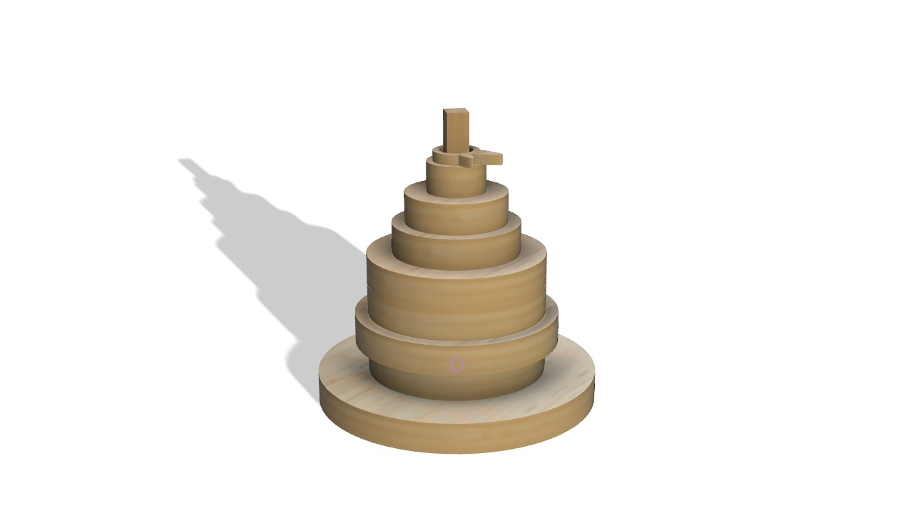

# Cria Sem Parar

> - **Criamos novas possibilidades de brincar a partir daquilo que antes era desperdiçado.**

## Elementos do Grupo

| Número  | Nome             |
| ------- | ---------------- |
| 2023241 | Beatriz Domingos |
| 2024264 | Ema Perez        |
| 2024303 | Matilde Salgado  |

---

## Contexto de Design
![[todos.png|NESTOR mood board.png]]
>Apesar de integrarem diferentes linhas temáticas — **Flora**, **Amigos** e **Fruta** — os três brinquedos partilham os mesmos princípios conceptuais, pedagógicos e construtivos. Todos foram desenvolvidos a partir de sistemas modulares em bambu produzidos através de corte CNC, utilizando encaixes simples que permitem à criança montar, desmontar e explorar diferentes possibilidades de interação.

O projeto inspira-se nos princípios da **pedagogia Montessori**, que valoriza a autonomia, a experimentação e a aprendizagem através da manipulação direta dos objetos. Tal como nos materiais Montessori, os brinquedos incentivam a descoberta ativa, permitindo que a criança explore livremente as formas, os encaixes e as combinações possíveis ao seu próprio ritmo.

Os três produtos procuram estimular a criatividade, a coordenação motora fina, o raciocínio espacial e a resolução de problemas através da construção e da brincadeira livre. A ausência de uma única solução correta promove a imaginação e encoraja a criança a desenvolver as suas próprias interpretações e narrativas.

Formalmente, os brinquedos recorrem a uma linguagem visual simplificada inspirada em elementos familiares do universo infantil. A coleção **Flora** explora flores e plantas, a coleção **Amigos** aborda animais e relações sociais, enquanto a coleção **Fruta** se inspira em formas associadas aos alimentos. Apesar das diferenças temáticas, todas mantêm uma identidade visual coerente baseada em formas orgânicas, processos de construção semelhantes.

Optou-se ainda por manter os brinquedos numa aparência neutra e natural, valorizando a textura e a cor do bambu. Esta decisão permite que as crianças possam posteriormente personalizar as peças através da pintura, do desenho ou da coloração, transformando cada objeto numa criação única. Para além de estimular a expressão criativa, esta possibilidade prolonga o tempo de interação com o brinquedo, acrescentando novas etapas de exploração para além da montagem inicial.

Para além da dimensão lúdica e educativa, os produtos refletem os valores de sustentabilidade da NESTOR, promovendo a reutilização de materiais excedentes da indústria do mobiliário e uma relação mais consciente com os recursos. Assim, as três coleções apresentam universos distintos, mas encontram-se unidas pelos mesmos objetivos: aprender, criar e explorar através da brincadeira.

Resumo, referências coletivas e moodboard do grupo encontram-se em [contexto.md](contexto.md).

[Ver contexto completo →](contexto.md)

---

## Galeria de Produtos

<!-- Cada thumbnail liga à página individual de cada produto.
     Cada produto vive em produtos/<numero>-<nome>/index.md
     e tem uma sub-página produtos/<numero>-<nome>/processo.md -->

<!-- markdownlint-disable MD033 -->

  <!-- duplicar o bloco abaixo para cada produto do grupo -->

  <a class="gallery-card" href="produtos/beatriz/">
    
    <h3>Amigos</h3>
    
Beatriz Domingues

  </a>
  <a class="gallery-card" href="produtos/ema/">
    
    <h3>Frutas</h3>
    
Ema Perez

  </a>
   <a class="gallery-card" href="produtos/matilde/">
    
    <h3>Flora</h3>
    
Matilde Salgado

  </a>

  <!-- duplicar o bloco acima para cada produto do grupo  e substituir _modelo em ambas por <numero>-<nome> -->

<!-- markdownlint-enable MD033 -->
