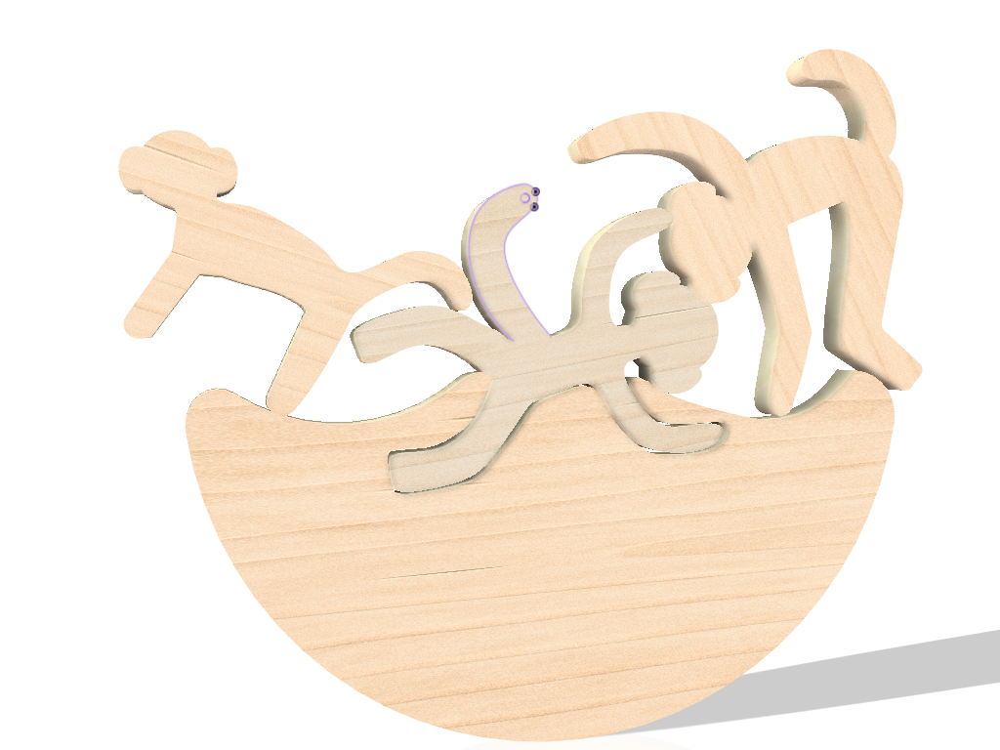
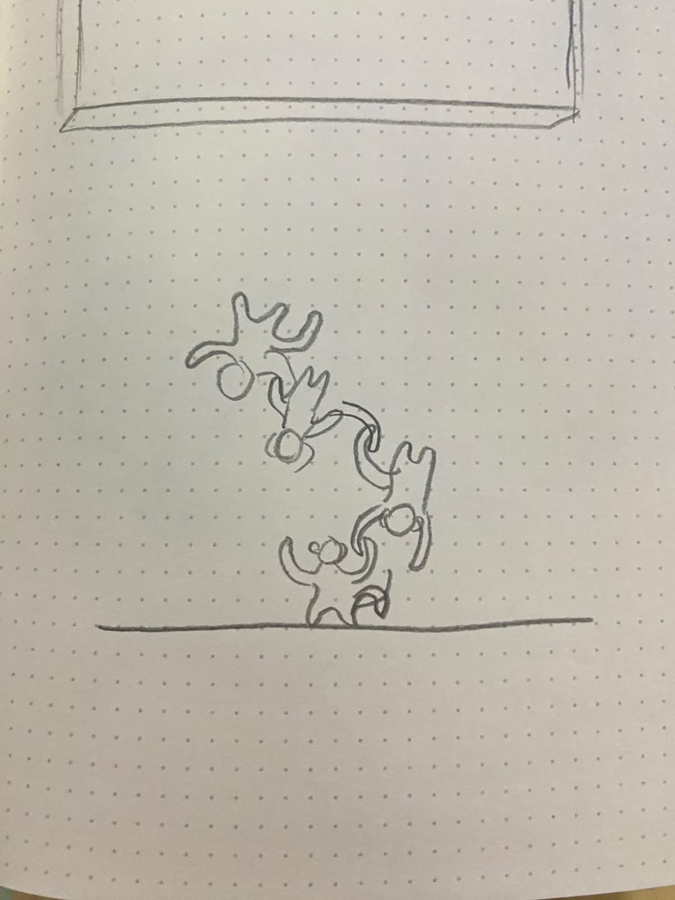
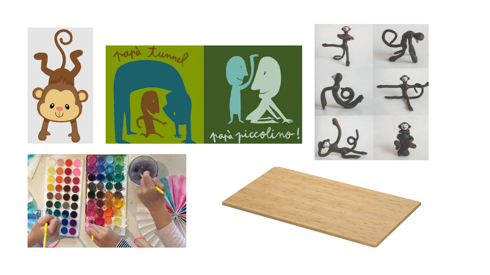
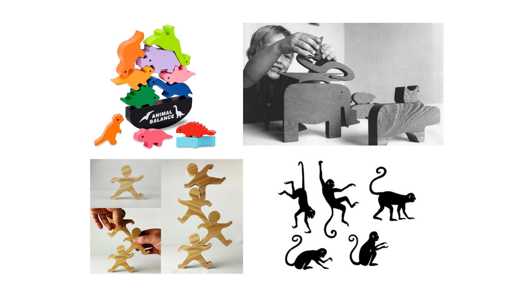

# Processo

> Organizado do **mais recente** para o **mais antigo**. Faz uma seleção que torne clara, aprazível e detalhada a evolução do produto e das ideias.

## 1. Protótipo(s)

Fotografias em estúdio com fundo branco do(s) protótipo(s) final(is).

![[composiçãobeatrizi.png|Protótipo final]]

## 3. Modelos 3D

Embed do Fusion (visualização do modelo paramétrico).
todas as peças juntas:[https://a360.co/4edfcpI](https://a360.co/4edfcpI)
primeira peça:[https://a360.co/3PQ43ly](https://a360.co/3PQ43ly)
segunda peça:[https://a360.co/4uGK87B](https://a360.co/4uGK87B)
terceira peça:[https://a360.co/439YmSu](https://a360.co/439YmSu)
base: [https://a360.co/3RCcxxb](https://a360.co/3RCcxxb)

## 4. Esboços e Pranchas-Resumo

Desenhos manuais, 
pranchas A3 de síntese, 
exploração de variantes.

## 7. Pesquisa

### 7.1. Aspectos valorizados do moodboard, desconstrução da forma (o que distingue o programa formal)

No desenvolvimento deste brinquedo procurei criar uma forma simples e de fácil identificação pelas crianças. A escolha dos macacos como elemento principal vem da associação que estes animais têm com o movimento e a brincadeira.

A forma do produto distingue-se pela combinação de uma base curva e várias peças independentes que podem ser colocadas em diferentes posições. Esta configuração cria um desafio de equilíbrio, incentivando a criança a experimentar, observar e corrigir os seus movimentos até encontrar uma estabilidade das peças.

Foram valorizadas as formas, evitando arestas agressivas para uma linguagem visual mais segura. A simplicidade facilita também a compreensão do funcionamento do brinquedo, permitindo que a criança descubra as regras através da exploração.

Desta forma, o programa formal distingue-se pela união entre uma estética simples e lúdica e uma função educativa, promovendo o desenvolvimento cognitivo, a coordenação motora e a capacidade de resolução de problemas através do jogo.

### 7.2. Objetos de referencia

Uma referência importante para o desenvolvimento deste projeto foi Enzo Mari, designer italiano reconhecido pelos seus brinquedos educativos e pela sua abordagem funcional ao design. Os seus projetos caracterizam-se pela simplicidade formal, pela utilização de materiais naturais e pela valorização da interação entre o utilizador e o objeto. Na representação simplificada dos macacos e na procura por uma experiência lúdica que estimule a curiosidade.

