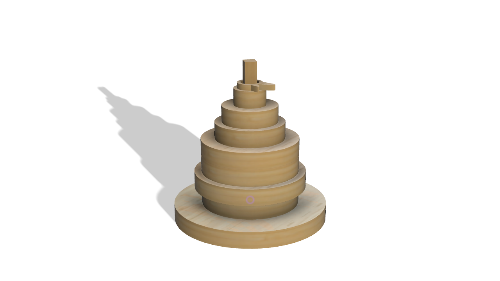
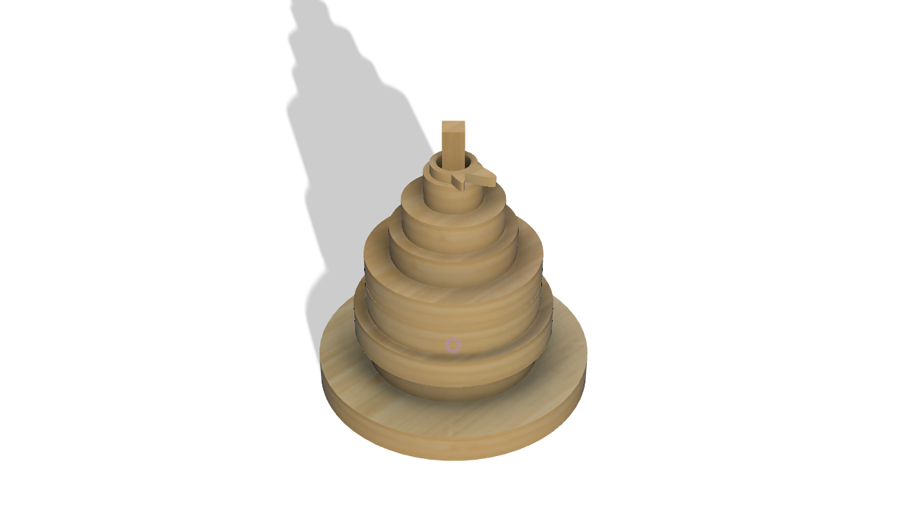
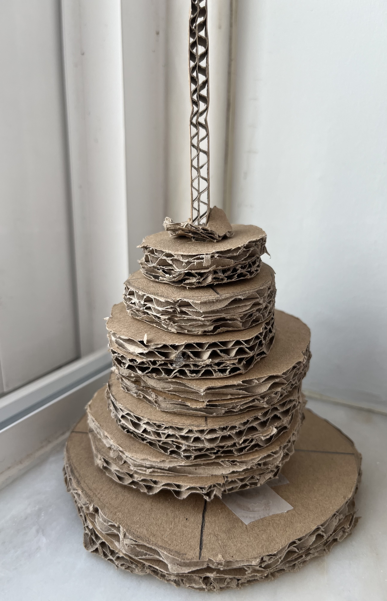
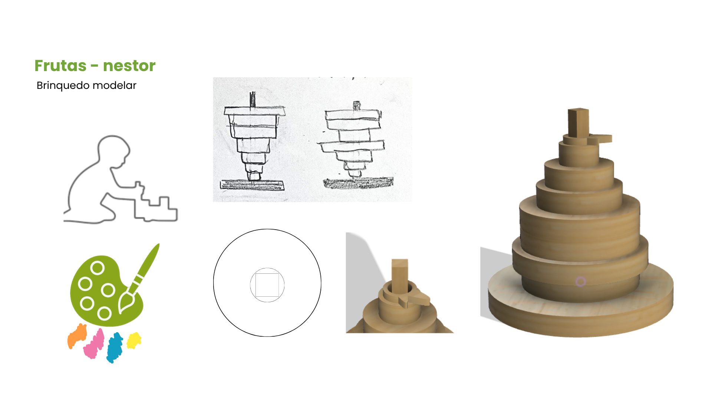
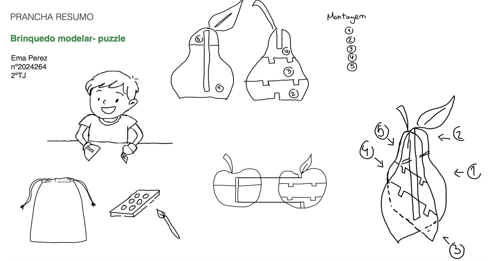
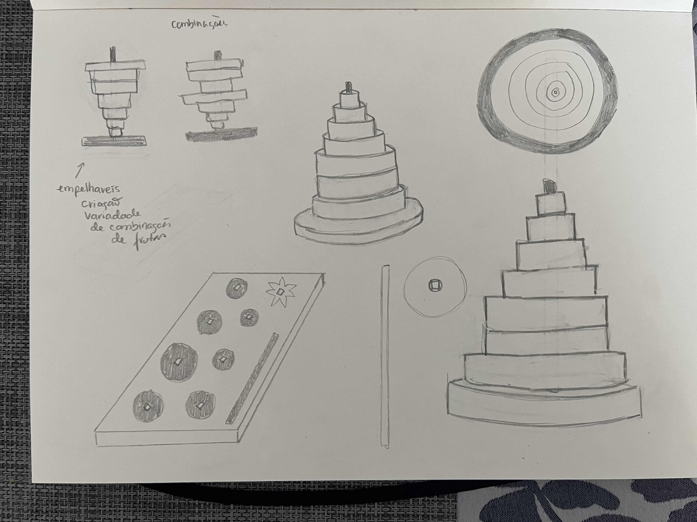
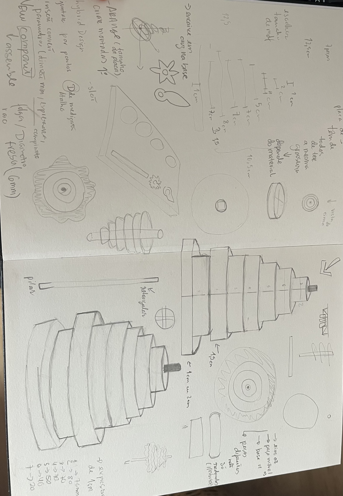
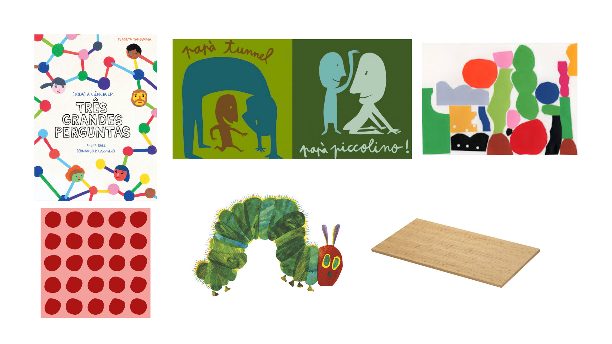
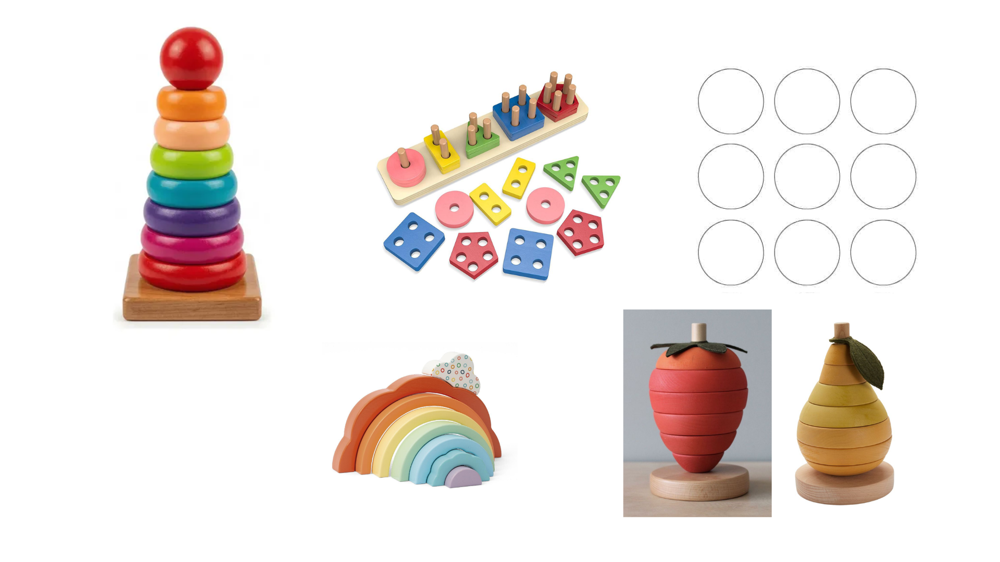

# Processo

> 

## 1. Protótipo(s)

Fotografias em estúdio com fundo branco do(s) protótipo(s) final(is).

## 3. Modelos 3D

Embed do Fusion (visualização do modelo paramétrico).

[https://a360.co/4nqYoPa](https://a360.co/4vlQaKY)

## 4. Outros Modelos

Maquete de estudo feita em cartão para perceber a forma que ficaria a perâ em 3d e se as dimensões variam sentido entre si.

## 6. Esboços e Pranchas-Resumo

Le-se de cima para baixo, a primeira prancha resumo é a final e em baixo tem a primeira prancha resumo feita no inicio do ano, onde vê se a evolução do projeto e a diferença do inicio para o fim. Também encontra-se aqui os meus esboços.

## 7. Pesquisa

### 7.1. Aspectos valorizados do moodboard, desconstrução da forma (o que distingue o programa formal)

A forma da pera foi analisada e simplificada através da sua decomposição em volumes circulares de diferentes diâmetros, como retirei do mood board formas redondas, simples, empilháveis e fáceis de identificar. Esta desconstrução permitiu criar um sistema modular constituído por oito peças empilháveis, mantendo a identidade visual da fruta ao mesmo tempo que possibilita novas combinações e interpretações formais. Ao contrário dos brinquedos de empilhamento tradicionais, que normalmente conduzem a uma única solução final, o sistema desenvolvido permite múltiplas configurações. A pera funciona como ponto de partida para a criação de outras frutas e formas imaginárias, incentivando a criatividade e a experimentação.

### 7.2. Objetos de referencia

O projeto inspira-se nos brinquedos de empilhamento em madeira associados à pedagogia Montessori, destacando a simplicidade formal, a interação manual e a aprendizagem através da exploração. A forma da pera serviu como referência para o desenvolvimento do sistema modular, permitindo criar uma figura reconhecível e, simultaneamente, múltiplas combinações e formas imaginárias. Tendo em que o nosso publico alvo ser crianças mais pequenas e não complicando muito a construção do brinquedo.

## 9. Outros Elementos

O desenvolvimento do projeto foi inspirado por diversas referências, da ilustração e do brinquedo educativo que já exitentes. Destaca-se o trabalho da Maria Montessori, pela pedagogia utilizada, da exploração sensorial das crianças e da construção livre e adquirir o pensamento criativo e a identificação de frutas já existem, como forma de aprenderem.

Fiz pesquisa sobre os princípios da pedagogia Montessori, que valoriza a autonomia, a exploração sensorial e a aprendizagem através da experiência prática. Também pesquisei quais são as as aprendizagens essenciais para crianças entre os 3 e os 6 anos, para a criação do meu brinquedo.
