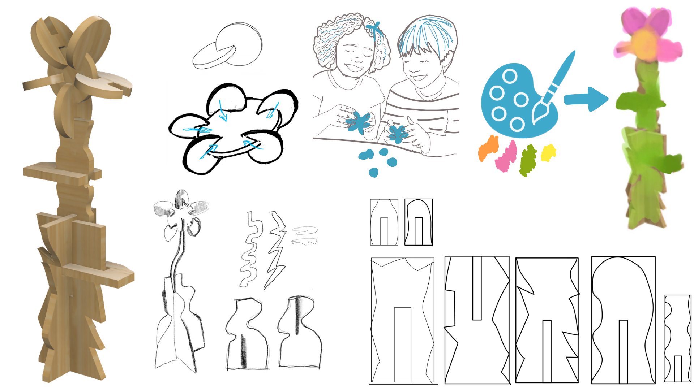
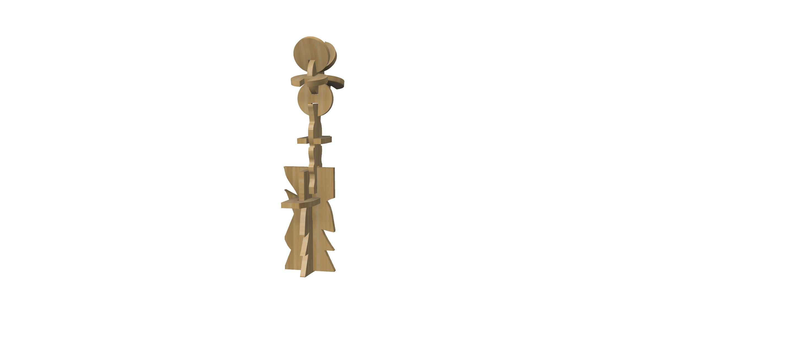

# Flora
<!--
  HERO: idealmente uma pseudo-sessão fotográfica do produto
  (ver tutorial Pletor.ai nos Recursos da disciplina, em
  /Recursos/AI_exps/). Usa attachments/hero.jpg para o frontmatter.
-->

>  - **Construir flores, descobrir formas, criar possibilidades.**
- **A natureza como ponto de partida para brincar.

## Conceito

O meu brinquedo desenvolvido para o projeto NESTOR baseia-se na criação de um sistema modular em bambu inspirado nos tazos e em formas orgânicas associadas à natureza, como flores e pétalas.

O meu projeto procura transformar a lógica simples, colecionável e combinatória dos tazos num objeto tridimensional e construtivo, permitindo que as crianças montem, desmontem e reorganizem diferentes composições através de encaixes modulares.

Dirigido a crianças entre os 3 e os 6 anos, quis proporcionar uma brincadeira estimular a criatividade, a experimentação e a coordenação motora das crianças através da construção livre.

Tal como os restantes produtos da marca, o acabamento neutro das peças permite ainda que estas possam ser posteriormente pintadas ou decoradas pelas crianças, incentivando a expressão artística e prolongando o tempo de interação com o objeto.

## Enquadramento

O projeto enquadra-se no contexto sustentável e modular do NESTOR, explorando o reaproveitamento de material excedente da indústria do mobiliário através do processo de nesting. As peças são produzidas a partir de áreas não utilizadas dos planos de corte CNC, transformando desperdício em objetos lúdicos e educativos.

A escolha dos tazos como objeto de partida surgiu pela sua simplicidade formal, caráter colecionável e potencial de combinação entre peças. A partir desta referência, o brinquedo reinterpretou a lógica de encaixe e recomposição dos tazos através de uma linguagem mais orgânica e tridimensional, inspirada em flores e elementos naturais.

Para além disso, tenho como referência práticas da pedagogia Montessori
Desta forma, o projeto estabelece uma relação entre memória lúdica, modularidade e sustentabilidade.

## Tecnologia

O brinquedo é produzido em bambu de 6 mm, escolhido pela sua resistência, leveza e carácter sustentável. A fabricação é realizada através de corte CNC, permitindo precisão nos encaixes e otimização do material disponível. O sistema de produção foi desenvolvido considerando as possibilidades do nesting, de forma a inserir automaticamente as peças nas áreas livres dos planos de corte industrial.

O desenvolvimento formal e técnico do brinquedo foi realizado através do programa Fusion, permitindo adaptar dimensões e encaixes de acordo com diferentes necessidades de produção.
Trabalhei utilizando o Autodesk Fusion, e posteriormete trabalhar as fromas no Illustrator.

- Modelo 3D: <[https://a360.co/4nqYoPa](https://a360.co/3RTPa28)
- Ficheiros: `attachments/`

## Função

O brinquedo funciona através de um sistema simples de encaixe entre peças, permitindo criar flores e diferentes composições tridimensionais. As peças podem ser montadas, desmontadas e reorganizadas livremente e pintadas, incentivando a experimentação e a construção criativa.

Destinado a crianças entre os 3 e os 6 anos, o brinquedo promove o desenvolvimento da coordenação motora, perceção espacial e imaginação. As dimensões e formas foram desenvolvidas considerando critérios de segurança e ergonomia adequados à faixa etária, evitando arestas cortantes e peças de pequena dimensão.

O projeto procura respeitar os princípios da Diretiva 2009/48/CE relativa à segurança dos brinquedos, garantindo materiais apropriados, resistência estrutural e utilização segura em contexto infantil.

## Apresentação

Imagens-chave que sintetizam o produto final.

---

## Processo

O percurso completo de iterações, modelos e pesquisa está em [processo.md](processo.md), organizado do **mais recente** para o **mais antigo**.

[Ver processo completo →](processo.md)
