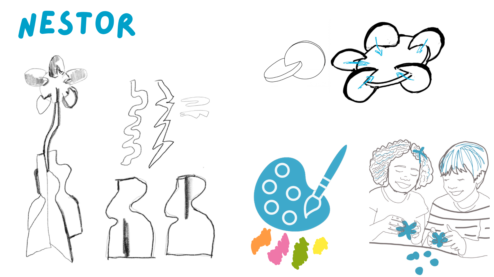
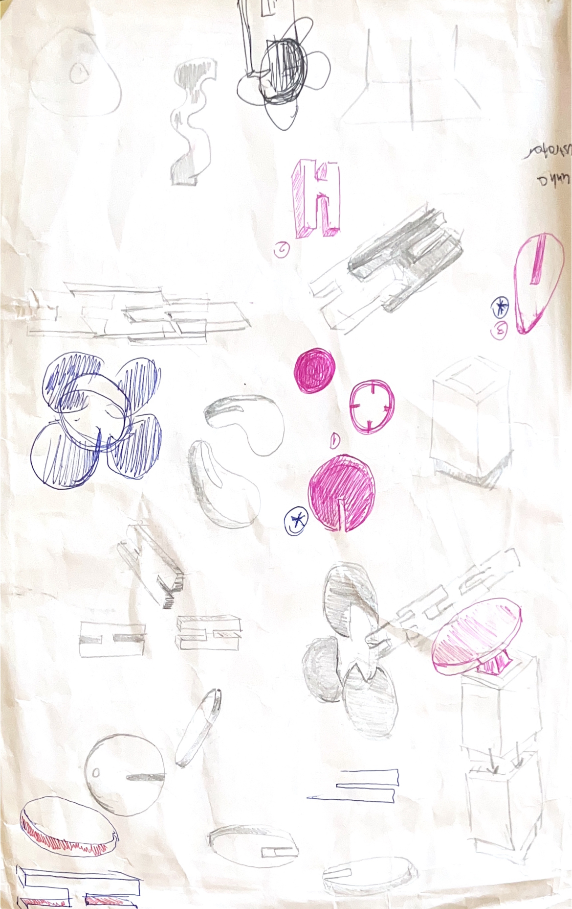
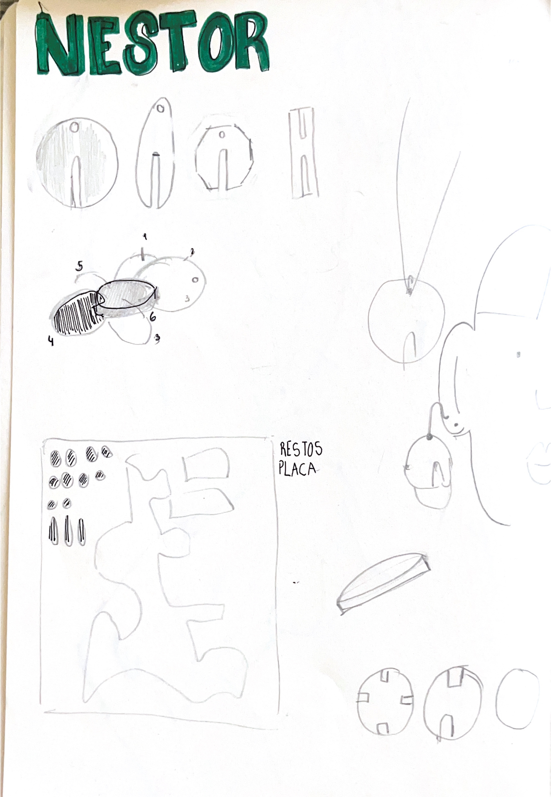
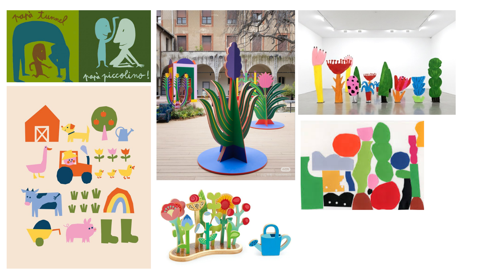
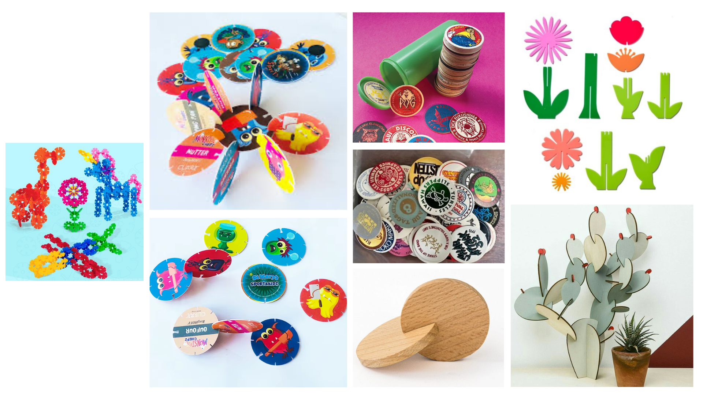

# Processo

> Organizado do **mais recente** para o **mais antigo**. Faz uma seleção que torne clara, aprazível e detalhada a evolução do produto e das ideias.

## 1. Protótipo(s)

Fotografias em estúdio com fundo branco do(s) protótipo(s) final(is).

![[foto 1.png|Protótipo final]]
![[foto 2.png]]

## 2. Modelos 3D

Embed do Fusion (visualização do modelo paramétrico).

[https://a360.co/4nqYoPa](https://a360.co/3RTPa28)

## 5. Outros Modelos

Durante o meu processo de trabalho, construí um protótipo de cartão com o intuito de explorar diferentes possibilidades formais, tamanhos e encaixes.![[maquete.jpeg|attachments/placeholder.png]]
![[maqueteestudo.jpeg|attachments/placeholder.png]]
![[maqueteiii.jpeg|maqueteii.jpeg]]

## 6.Esboços e Pranchas-Resumo
(mais recente para o mais antigo)

## 7. Pesquisa

### 7.1. Aspectos valorizados do moodboard, desconstrução da forma (o que distingue o programa formal)

### 7.2. Objetos de referencia

Uma das referências mais relevantes a nível de investigação e pesquisa foi o trabalho de Enzo Mari, em particular os seus brinquedos em madeira compostos por peças simples e multifuncionais, capazes de estimular a imaginação da criança através da construção livre.
A nível histórico, analisei o fenómeno dos Milk Caps, jogo tradicional havaiano que inspirou os tazos. 
Procurei também diferentes brinquedos com diferentes sistemas de encaixe e outros que tivessem flores como ponto de partida.

## 9. Outros Elementos

O desenvolvimento do projeto foi influenciado por diversas referências do design, da ilustração e de brinquedos educativos. Destacam-se os trabalhos de Enzo Mari e da Nora Puzzle, pela exploração da modularidade, dos sistemas de encaixe e da construção livre.

A nível visual, as ilustrações de Bernardo Carvalho, Yara Kono e Ekaterina Trukhan inspiraram a simplificação formal, as formas orgânicas e a representação de elementos naturais.

Foram também analisados materiais pedagógicos inspirados nos Froebel Gifts e nas metodologias de Bruno Munari, que valorizam a experimentação, a criatividade e a aprendizagem através da manipulação de objetos.

Paralelamente fiz pesquisa acerca dos princípios da pedagogia Montessori, que valoriza a autonomia, a exploração sensorial e a aprendizagem através da experiência prática. Tal como nos materiais Montessori, quis que o meu brinquedo incentivasse a manipulação direta, a experimentação e a descoberta autónoma, permitindo que a criança aprenda através da construção e da resolução de problemas.

Materiais consultados:
[https://froebelgifts.com](https://froebelgifts.com)
[https://www.notion.so/KIT-SAVANA-210a4ae006aa801f858ae08aabe426c2](https://www.notion.so/KIT-SAVANA-210a4ae006aa801f858ae08aabe426c2)
[https://pt.pinterest.com/norapuzzle/](https://pt.pinterest.com/norapuzzle/)
[https://norapuzzle.com](https://norapuzzle.com)
[https://www.vaneesterenmuseum.nl/en/objecten/speel-goed-door-architecten-16-animali-van-enzo-mari](https://www.vaneesterenmuseum.nl/en/objecten/speel-goed-door-architecten-16-animali-van-enzo-mari)
[https://repositorio.upt.pt/entities/publication/37999206-eaa6-4f45-8e7f-f4585ccdf033](https://repositorio.upt.pt/entities/publication/37999206-eaa6-4f45-8e7f-f4585ccdf033)
[KARINA_DE_CASSIA_CHRISTINO_DIAS_ATIVIDADE_3.pdf](https://repositorio.pgsscogna.com.br/bitstream/123456789/25893/1/KARINA_DE_CASSIA_CHRISTINO_DIAS_ATIVIDADE_3.pdf)
[https://www.wallpaper.com/design-interiors/interior-accessories/studiomama-face-castings](https://www.wallpaper.com/design-interiors/interior-accessories/studiomama-face-castings)